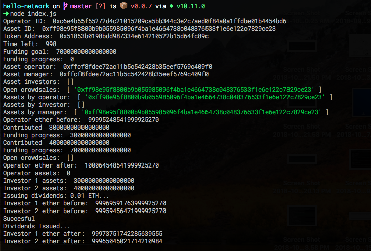

# Hello World Tutorial

## Hello-Network

🔷 A hello world example for the MyBit Network

This hello world example will get you familiarised interacting with MyBit protocol smart contracts using basic web development knowledge.

Our hello world mimics a successful crowdsale to buy a coffee machine for a coffee shop. With the revenue generated from coffees sold, crowsale investors receive a return on their investment. 

## Component dependencies

To run a "hello world", it is good practice to understand the underlying components. Hello-network rely on deploying in local both **@mybit/chain** and **@mybit/network.js**

* **@mybit/chain** is a locally deployed instance of MyBit blockchain. [Github](https://github.com/MyBitFoundation/MyBit-Chain.tech).
* **@mybit/network.js** mirrors our Javascript class/API used to interact with MyBit Network SDK smart contracts.  [Github](https://github.com/MyBitFoundation/network.js). @mybit/network.js relies therefore on **@mybit/contracts**, which are  SDK contracts deployed by MyBit. [Github](https://github.com/MyBitFoundation/MyBit-Network.tech). 

## Quick start guide

All the steps below should be run on the command line: 

1. Clone this hello-network repository 

```text
git clone https://github.com/MyBitFoundation/hello-network.git
```

1. Install your local blockchain. See [installation](https://developer.mybit.io/hello-network/~/edit/drafts/-LP3bZnshIxL8ayzSrK6/set-up-mybit-chain#how-do-i-install-mybit-chain).
2. Within your project directory, run hello-network on terminal 

 `node index.js`

### Output expected

Once you run the above, your terminal output should look like this: 



In the following sessions, we will explain in more detail how to set up the components to run your "hello world" and explain step-by-step through our `~/hello-network/index.js`example the Javascript class/API  used to interact with MyBit Network SDK smart contracts. 

