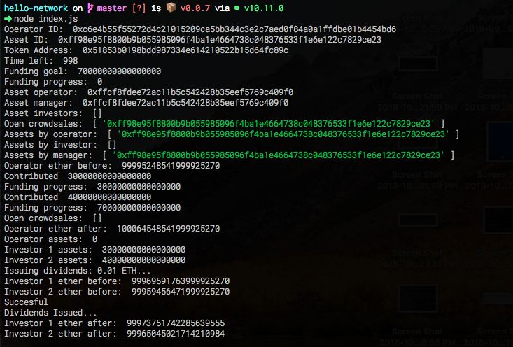

# End to end example

In this session we will cover in detail the execution of function `fundCoffee()` of our "hello world" application which outputs the final result in the terminal console. 

**setOperator \(\) returns \(operatorID\)**

Pass as addOperator with operatorAddress, operatorURI, platformOnwer and get back the address of the operator.

```javascript
operatorID = await setOperator();
console.log('Operator ID: ', operatorID);
```

**startCrowdsale\(\) returns \(object\)**

Function used with createAsset\(\) to start a crowdsale to fund a new asset you must pass this function and object that contains as parameters assetURI, operatorID, fundingLength, amountToRaise,  brokerPercent,  operatorAddress

```javascript
var response = await startCrowdsale();
```

The function returns an object that contains in our case \_assetID and \_tokenAddress.

```javascript
assetID = response._assetID;
console.log('Asset ID: ', assetID);
```

```javascript
var tokenAddress = response._tokenAddress;
console.log('Token Address: ', tokenAddress);
```

**dividendTokenETH\( tokenAddress \) returns \( contract instance \)**

This function takes a contract address for an already deployed [DividenToken.sol](https://github.com/MyBitFoundation/MyBit-Network.tech/blob/master/contracts/tokens/erc20/DividendToken.sol) contract, instantiates the contract, and exposes all of its public functions.

```javascript
token = await Network.dividendTokenETH(tokenAddress);
```

### Get functions

**getFundingTimeLeft\( assetID \) returns \( uint \)**

Pass an assetID and get back the time in seconds until the crowdsale finishes. If the crowdsale is already finished, you'll receive 0.

```javascript
var timeleft = await Network.getFundingTimeLeft(assetID);
console.log('Time left: ', timeleft);
```

**getFundingGoal\( assetID \) returns \( uint \)**

Pass an assetID and get back the funding goal for the asset. If the asset is funded, you'll get back the total supply of tokens.

```javascript
var fundingGoal = await Network.getFundingGoal(assetID);
console.log('Funding goal: ', fundingGoal);
```

**getFundingProgress\( assetID \) returns \( uint \)**

Pass an assetID and get back the current amount that the asset has been funded.

```javascript
var fundingProgress = await Network.getFundingProgress(assetID);
console.log('Funding progress: ', fundingProgress);
```

**getAssetOperator\( assetID \) returns \( address \)**

Pass an assetID and get back the address of the operator.

```javascript
var operator = await Network.getAssetOperator(assetID);
console.log('Asset operator: ', operator);
```

**getAssetManager\( assetID \) returns \( address \)**

Pass an assetID and get back the address of the asset manager.

```javascript
var manager = await Network.getAssetManager(assetID);
console.log('Asset manager: ', manager);
```

**getAssetInvestors\( assetID \) returns \( array \)**

Pass an assetID and get back an array of all the addresses that have funded it.

```javascript
var investors = await Network.getAssetInvestors(assetID);
console.log('Asset investors: ', investors);
```

**getOpenCrowdsales\(\) returns \( array \)**

Get an array of all assetIDs that are currently seeking funding.

```javascript
var crowdsales = await Network.getOpenCrowdsales();
console.log('Open crowdsales: ', crowdsales);
```

**getAssetsByOperator\( address \) returns \( array \)**

Pass an address and get back an array of assetIDs operated by that operator.

```javascript
var operatorAssets = await Network.getAssetsByOperator(operatorAddress);
console.log('Assets by operator: ', operatorAssets);
```

**getAssetsByInvestor\( address \) returns \( array \)**

Pass an address and get back an array of assetIDs owned by that investor.

```javascript
var investorAssets = await Network.getAssetsByInvestor(accounts[3]);
console.log('Assets by investor: ', investorAssets);
```

**getAssetsByManager\( address \) returns \( array \)**

Pass an address and get back an array of assetIDs managed by that asset manager.

```javascript
var managerAssets = await Network.getAssetsByManager(operatorAddress);
console.log('Assets by manager: ', managerAssets);
```

**getBalance \(address\) returns \(uint\)**

Pass the operatorAddress and get back the current balance of the operatorAdress at a given block.

```javascript
//Check operator's funds before
console.log('Operator ether before: ', await web3.eth.getBalance(
  operatorAddress));
```

**contribute\(account, amount\) returns \(string, amount\)** 

Pass the investor addresses and the asset investment amont.  getFundingProgress on asset \(see above\) after each investor contribution.

```javascript
await contribute(accounts[3], 30000000000000000);

var fundingProgress = await Network.getFundingProgress(assetID);
console.log('Funding progress: ', fundingProgress);

await contribute(accounts[4], 40000000000000000);

var fundingProgress = await Network.getFundingProgress(assetID);
console.log('Funding progress: ', fundingProgress);
```

**getOpenCrowdsales\(\) returns \( array \)**

Get an array of all assetIDs that are currently seeking funding. After checking between funding goal and funding progress, returns array of open crowdsales.

```javascript
var crowdsales = await Network.getOpenCrowdsales();
console.log('Open crowdsales: ', crowdsales);
```

**getBalance \(address\) returns \(uint\)**

Pass the operatorAddress and get back the current balance of the operatorAdress after investors' contribution.

```javascript
console.log('Operator ether after: ', await web3.eth.getBalance(
  operatorAddress));
```

**balanceof \(address\) returns \(uint\)**

Pass operator and investors address and get back the number conversion of the balance of the addresses.

```javascript
console.log('Operator assets: ', Number(await token.balanceOf(
  operatorAddress)));
console.log('Investor 1 assets: ', Number(await token.balanceOf(accounts[
  3])));
console.log('Investor 2 assets: ', Number(await token.balanceOf(accounts[
  4])));
```

### Dividends issuance

**getBalance \(address\) returns \(uint\)**

Pass the investorAddress and get back the current balance of each investorAdress before dividend.

```javascript
console.log('Issuing dividends: 0.01 ETH...');
console.log('Investor 1 ether before: ', await web3.eth.getBalance(
  accounts[3]));
console.log('Investor 2 ether before: ', await web3.eth.getBalance(
  accounts[4]));
```

**issueDividends\( assetID, account, amount \) returns \( bool \)**

To pay out dividends to investors, the operator can call this function. Pass the assetID, the account from which you want to pay, and the amount you'd like to pay. The function determines if the asset takes Ether or an ERC-20 token. If the account does not have a sufficient balance in the required payment method, the function will fail.

```javascript
await Network.issueDividends(assetID, operatorAddress, 10000000000000000);
console.log('Dividends Issued...');
```

**withdraw\(assetID\) returns \(bool\)**

Investors can call withdraw function to decide to retrieve dividend tokens received on the asset. 

```javascript
await token.withdraw({
  from: accounts[3]
});
await token.withdraw({
  from: accounts[4]
});
```

**getBalance \(address\) returns \(uint\)**

Pass the investorAddress and get back the current balance of each investorAdress after dividend.

```javascript
console.log('Investor 1 ether after: ', await web3.eth.getBalance(
  accounts[3]));
console.log('Investor 2 ether after: ', await web3.eth.getBalance(
  accounts[4]));
```

### Output on terminal

The final result of our "hello world" should look like this: 




